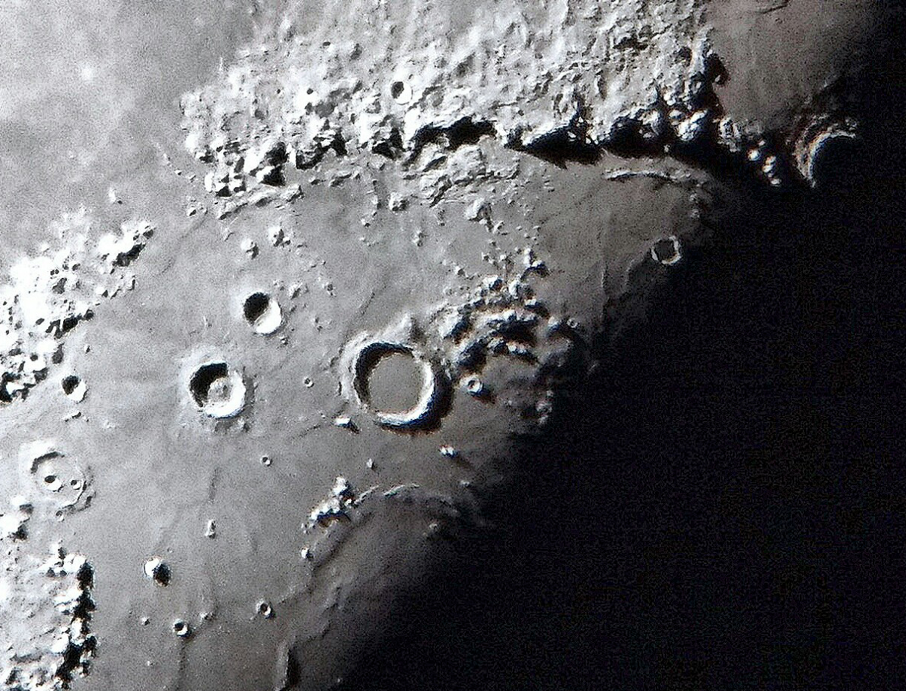
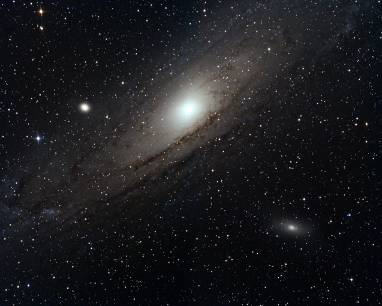
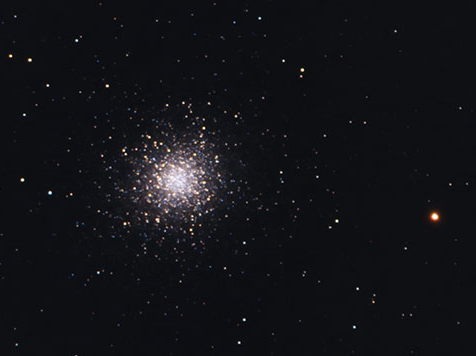
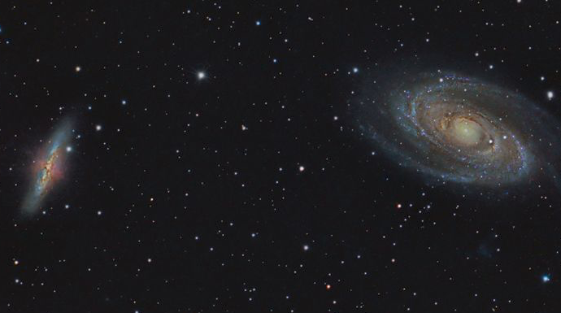
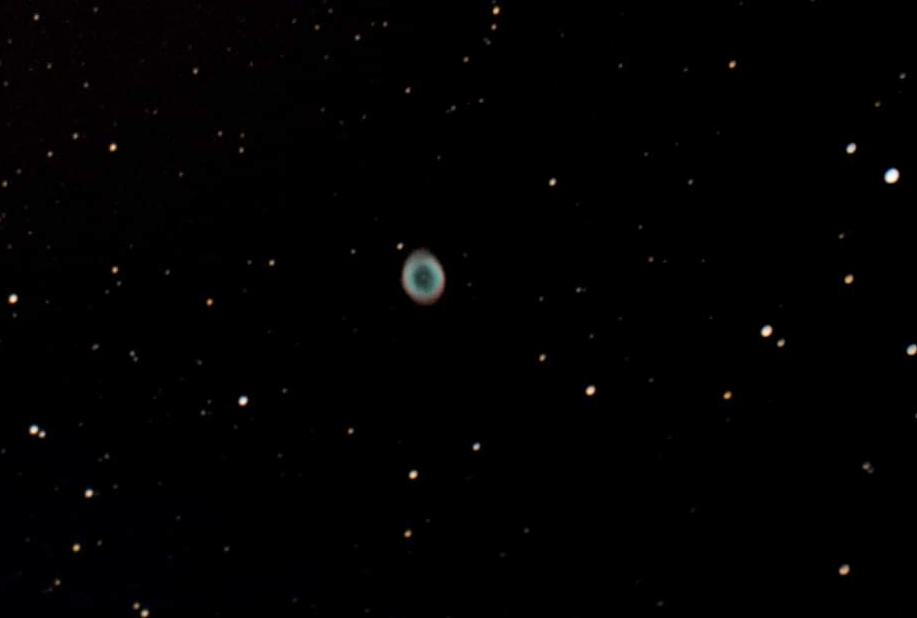
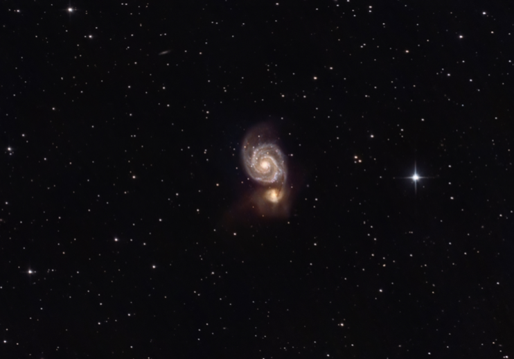
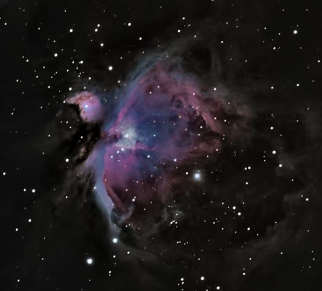
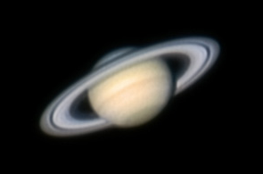
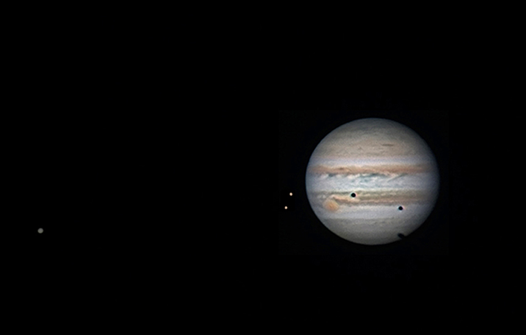

## Astro Photos taken via a similar 8" Newtonian Telescope

### Craters of the Moon

<iframe width="740" src="https://www.youtube.com/watch?v=7gWu5l_fvIM" frameborder="0" allow="accelerometer; autoplay; encrypted-media; gyroscope; picture-in-picture" allowfullscreen></iframe>

### Andromeda Galaxy M31

### Hercules Globular Cluster M13

### Bode's Galaxy & Cigar Galaxy M81/82

### Ring Nebula M57

### Whirlpool Galaxy M51

### Orion Nebula M42 (Not visible during Cascade)

### Saturn (Not visible during Cascade)

### Jupiter (Not visible during Cascade)
