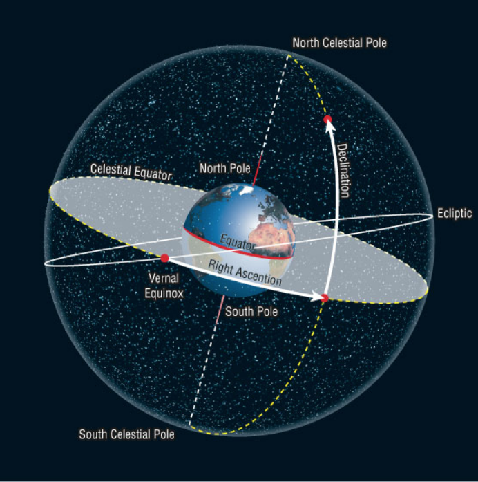
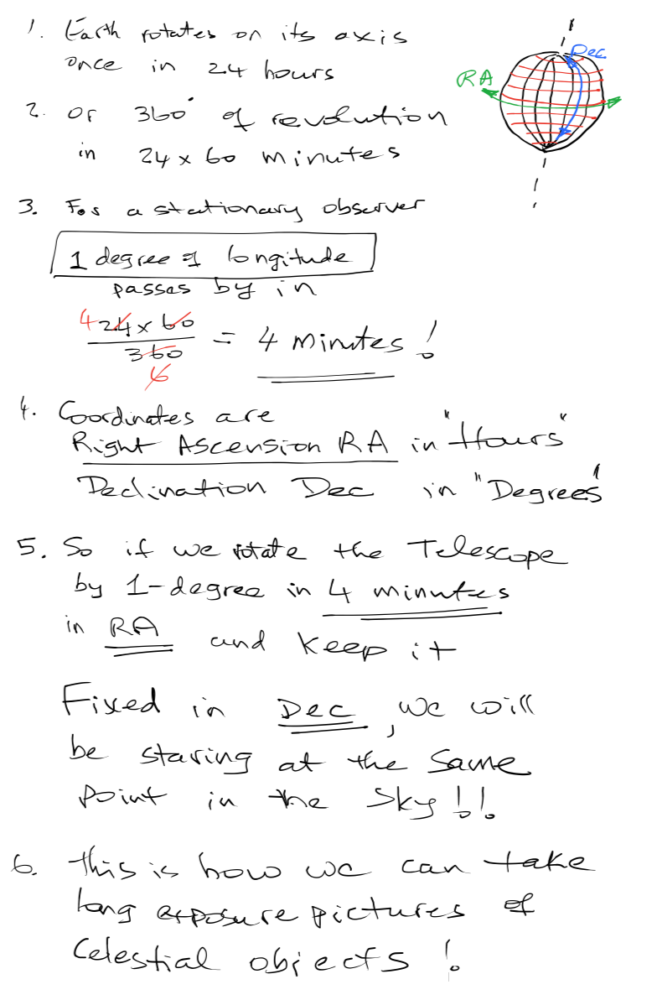

# Celestial Coordinate System

## How fast is the Earth rotating?

### OR Conversely

## How fast is the sky rotating for a stationary observer on the surface of our planet?
## And how can a Telescope compensate for that apparent motion of the sky??

