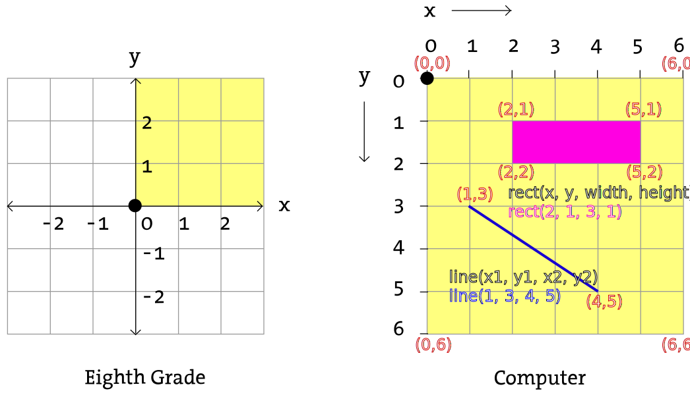
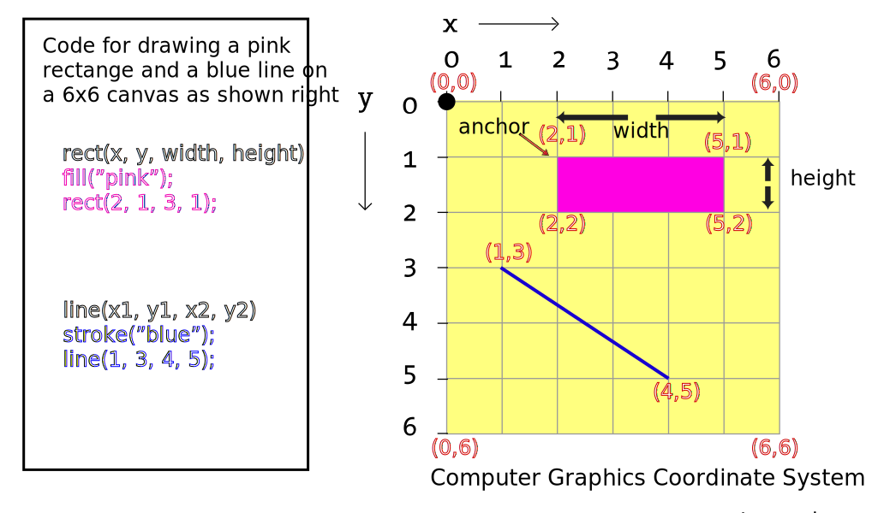

## Dynamic Rectangles Example Starter Code
### While reading this example remember the graphics canvas coordinates are defined as follows:



### Computer Graphics coordinate system and shapes that we will use



### Copy & Paste all the lines of code in the box below into the editor you previously opened

```javascript
// Dynamic Rectangles
// Learn to code visually!
// text following // are help comments !!
// Modify lines with "***AND ALL CAPS LETTERS like this"

// Do not worry about breaking anything as you can come back to the original version of this code!!

let loc1 = 0; // set up a variable pixel location for rect1
let loc2 = 0; // set up a variable pixel location for rect2

function setup() { // this function is run once.   
  // canvas size in pixels
  // width is set to 600, and height to 200
  createCanvas(400, 200);
}

function draw() { // this function is run repeatedly.  

  // set the background color to cyan
  background("cyan");
  
  // 1. Say Hello 
  // ***UNCOMMENT LINE BELOW BY DELETING THE 2 SLASHES TO SEE WHAT HAPPENS!
  //sayHello();

  // 2. Draw a rectangle
  // ***UNCOMMENT LINE BELOW BY DELETING THE 2 SLASHES TO SEE WHAT HAPPENS!
  //drawRect1();
  
  // 3. Draw another rectangle!
  drawRect2();
  
}

function sayHello() {
  // ***SAY HELLO TO YOUR FRIENDS - MODIFY TEXT BELOW!! 
  // use input parameters: quoted text, x, y loc in pixels
  fill("black");
  textSize(20);
  text("Hello friends!", 70, 30);  
}

function drawRect1() {
  // draw a moving orange rectangle using input parameters:
  // x loc, y loc, width, and height 
  fill("orange");
  rect(loc1, 50, 100, 50);

  // move loc1 over to by 5 pixels
  // reset to 0 if width of canvas is exceeded!
  if (loc1 < width) {
    loc1 = loc1 + 5;
  } else {
    loc1 = 0;
  }  
}

function drawRect2() {
// ***DRAW A VERICAL RECT WITH A DIFFERENT COLOR
// MOVING FROM TOP TO BOTTOM AT ANOTHER SPEED?
// YOU WILL NEED COPY CONTENTS OF drawRect1() FUNCTION 
// BETWEEN OUTER BRACKETS BELOW
// MODIFY THE fill COMMAND TO CHANGE COLOR
// MODIFY THE rect COMMAND (Hint: switch height & width parameters)
// MODIFY OTHER LINES (Hint: SWAP ALL REFERNCES TO loc1 WITH loc2)
// CHANGE THE INCREMENT OF loc2 TO A DIFFERENT VALUE 

}
```