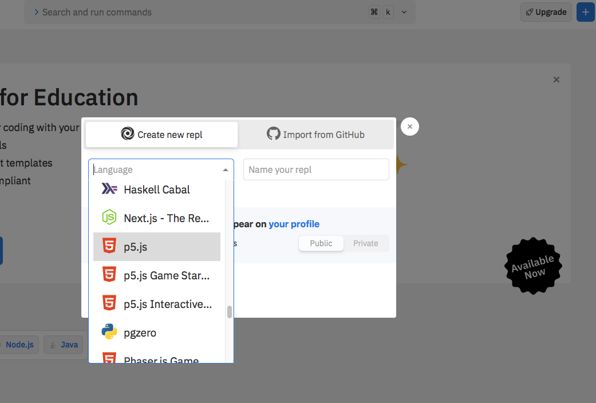
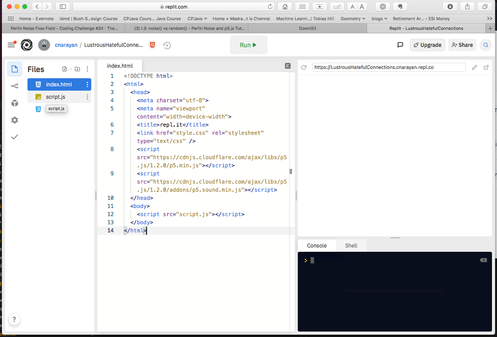
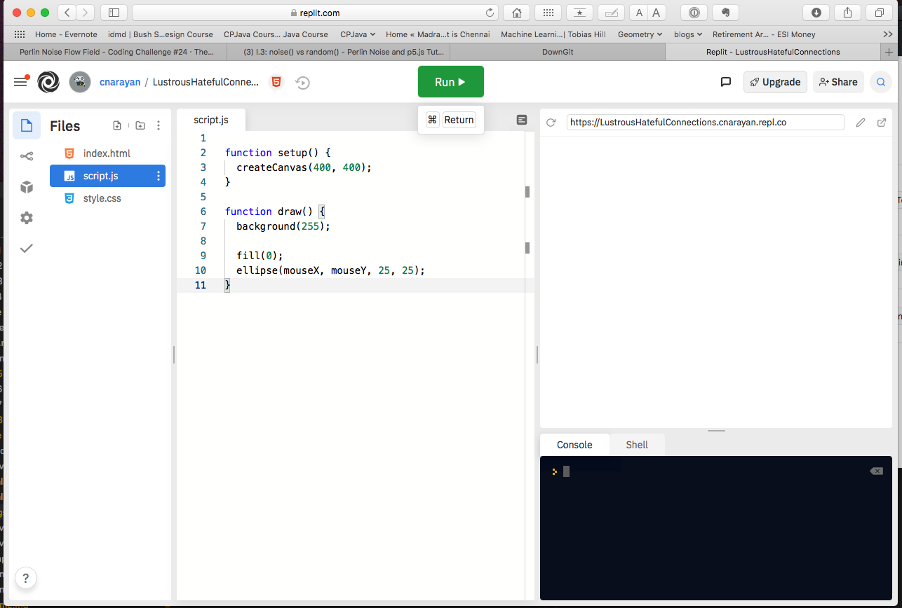
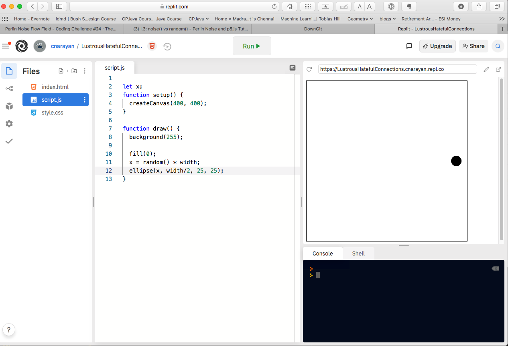
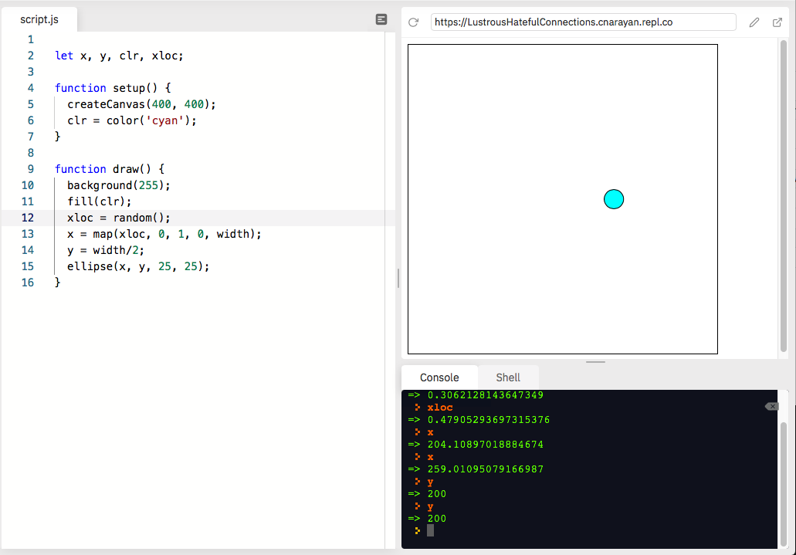
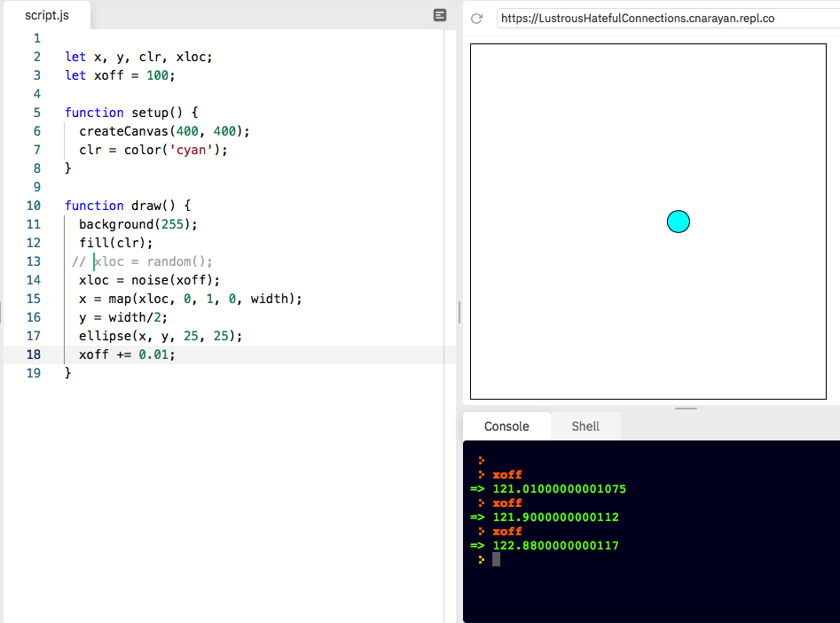
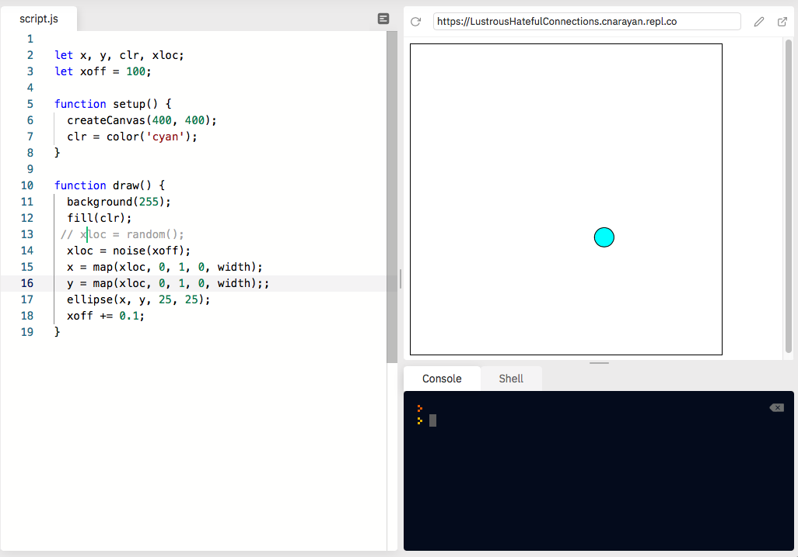
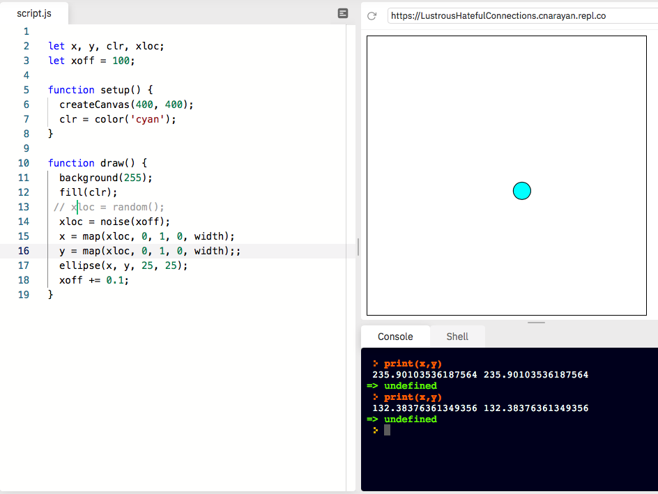
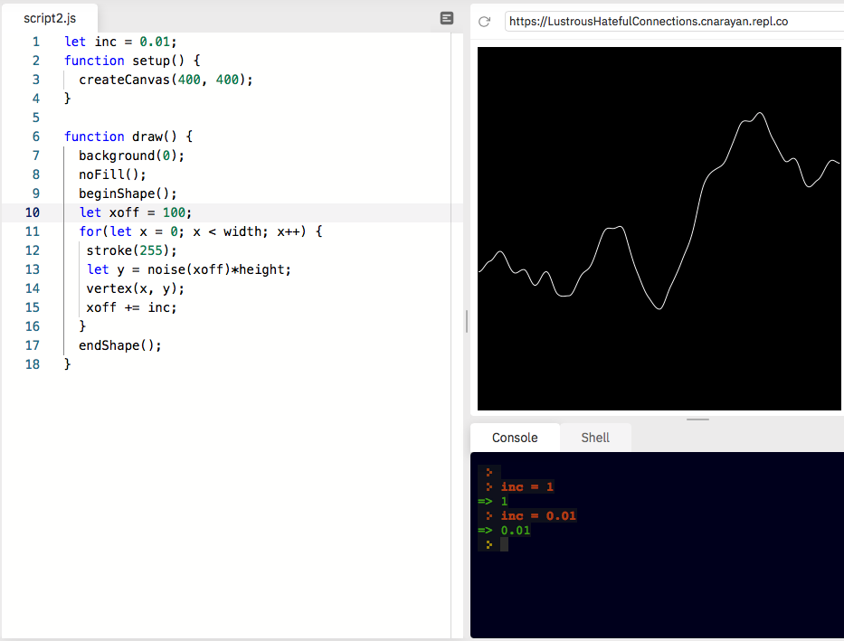
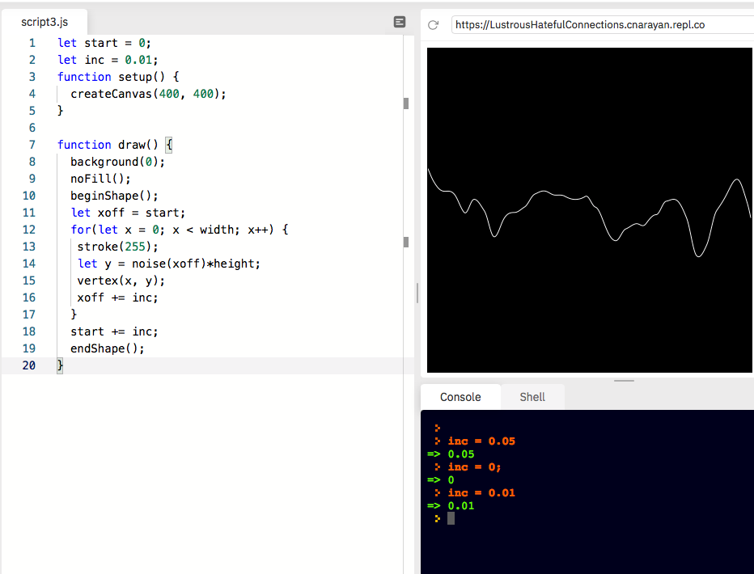

[_Bush School IDMD Spring Semester 2021_](https://chandrunarayan.github.io/idmd/)

# Week 8

## Learning Objectives
* Learning to use the repl.it editor for debugging
* Learn about Perlin Noise
* Simulate bugs using arrays

## Week 8 Lessons
* [Install the Repl editor](https://replit.com/signup?from=landing)  - Login/Register with your Bush ID

  * 
  * 

* How to debug code

  * 
  * 
  * 
  * 

* Demonstrate difference between random() & noise()
  * 
* Create a moving plot of perlin noise
  * 
  * 
  * 
  * 

## Homework
* Exercise: Update click-timer from last week with perlin noise
* [Project: Atrract Bugs with Food](bugs_food.md)

