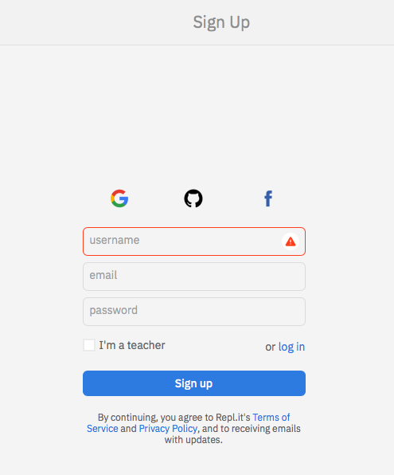

[_Bush School IDMD Spring Semester 2021_](https://chandrunarayan.github.io/idmd/)

# Week of March 22nd

## Learning Objectives
* Learning to use the repl.it editor for debugging
* Learn about Perlin Noise
* Simulate bugs using arrays

## Week 8 Lessons
* [Install the Repl editor](https://replit.com/signup?from=landing)  - Login/Register with your Bush ID

  * 
  * 

* How to debug code

  * 
  * 
  * 
  * 

* [What is perlin noise?](https://en.wikipedia.org/wiki/Perlin_noise)
  * 

* Demonstrate difference between random() & noise()
  * 
* Create a moving plot of perlin noise
  * 
  * 
  * 
  * 

## Homework
* Exercise: Update click-timer from last week with perlin noise
* [Project: Attract Bugs with Food](code/bugs_moving_to_food.md)

## Cloud Recording of Zoom
[March 22nd Cliud Recording](https://zoom.us/rec/share/W-Vqwy-K2zRsv1bMAZ2E6Pa3od1_qUN8CVABc-rNetTqh5iZ0L8J363iE_t4lESB.YG0X-zlqwgSrWvqQ) Passcode: .7kp.t!q