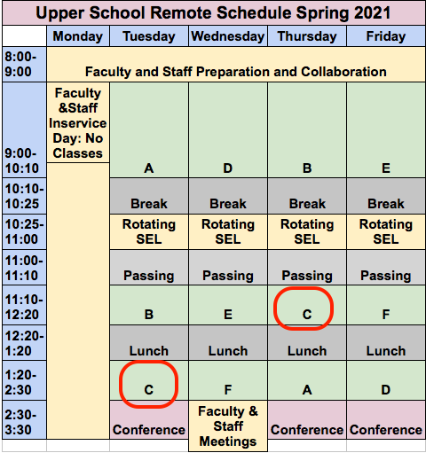
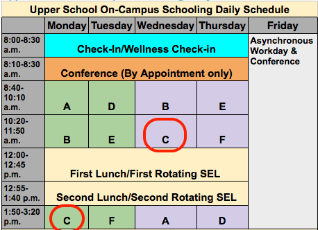

[_Bush School IDMD Spring Semester 2021_](https://chandrunarayan.github.io/idmd/)

# IDMD - Interactive Digital Media Design
Software influences all aspects of contemporary visual culture. This course is an introduction to computer programming within the context of the visual art. Students in this course will learn the fundamentals of computer programming -- conditional control structures, iteration, data structures, functions, classes, objects, and event-driven design. We will create projects based on student interest including, but not limited to games, machine-learning inspired art, simulations of physical, biological and social phenomena.

We will learn and create using the programming language Javascript and the library p5.js, a full featured library that allows one to create interactive digital art for the web. Below is an example of a game you could develop using P5JS and Javascript!

### Bouncing Bubbles Model Javascript Program

<a href="https://chandrunarayan.github.io/sketches/bubbles" target="blank">Click here for live code of bouncing bubbles and try clicking them inside resulting new tab or window. Like what you see? This course will be all about developing skills to simulate nature on your computer in a fun, engaging manner and learn Javascript on the side!</a>

## Remote/Hybrid Classroom Applications

In our IDMD classroom we are already using tools and techniques that are naturally adapted to a remote learning format. We will continue using our already established tools and techniques for learning IDMD.  We will add to that, a video conferencing solution  to complete our toolset needed for remote learning! All applications (except email) are to be run using your Chrome Browser on your laptop. 

1. [ZOOM for IDMD](https://zoom.us/j/5176316708) - video conferencing application - join here each day and time IDMD classes are held
2. [IDMD WEBSITE](https://chandrunarayan.github.io/idmd/) - lessons, exercises, projects, student-portfolios, references
3. [Google Classroom](https://classroom.google.com/u/0/c/MjQ5OTg2OTEwMDEz?cjc=gmy37a3) - code extracts, worksheet and document submissions, additional materials
4. [GITHUB repository](https://github.com/) - code submissions for exercises and projects, published student portfilios
5. [P5JS Web Editor](https://editor.p5js.org) - web code editor for p5js
6. [Student Portfolios](student-work.md) - Links to Student Porfolios
7. [Online textbooks](https://drive.google.com/drive/folders/1_zq8eZnKCsoD5Y-22_pZfTbOgZg2dwmB?usp=sharing) - Getting Started with P5JS 
8. [Bush PORTAL](https://bush.myschoolapp.com/app/faculty#academicclass/110760511/0/bulletinboard) - links for all tools, official assignments, schedules, syllabus, grade rubric
9. Conference Appointments:
   * [Async Zoom Scheduler](https://calendly.com/chandru-narayan/anytime-wed-async) - Wed 9:00 AM to 5:30 PM
   * [Ad-Hoc 1-1 Conf Scheduler](https://calendly.com/chandru-narayan/adhoc-conf) Mon, Tue, Thu, Fri: 2:30-5:30 PM
10. EMAIL - check your Bush email when all other forms of communication fails! 

#### [Remote/Hybrid Schooling Daily Schedules](./BSDS_R.png)

#### A Reminder
We are all going through some extraordinary times due to the coronavirus.  I would like to ask you to be safe and considerate of others. Let us take time to be vigilant about wearing masks, washing hands, not touching our face and avoiding being in large groups. Most of all, be calm about things beyond our control.

## Course Documents

* [Syllabus](syllabus.md)
* [Topic List](topic-list.md)
* [Student Portfolios](student-work.md)
* [Exercise/Project Requirements](final-project.md)

## Course Links

* Course Website: [IDMD 2021 Website](https://chandrunarayan.github.io/idmd/)
* Bush Portal: [IDMD Portal](https://bush.myschoolapp.com/app/faculty#academicclass/110760511/0/bulletinboard)
* Online textbook: [Getting Started with P5JS](https://drive.google.com/drive/u/2/folders/15GK0VESxqTvYGst9EtvILshb0MGlO4c5)
* P5JS Basics: [Wiki Page for Help Examples and Reference](https://github.com/processing/p5.js/wiki/JavaScript-basics)
* Other Course materials: [Google Drive IDMD](https://drive.google.com/drive/folders/1y16Sl6du4C773Iy2czlFcVXpeBPmvFYN)
* Assignment Submissions via [Your Github Site](https://github.com/)

## Course Credit

This course draws from the materials used in the UW Human Center for Design Engineering Master of Science curriculum. Significant credit is also due to the many member founders of the Processing Foundation whose tireless efforts have advanced the cause for open, accessible, and free CS education across the world.

## Lessons

### [Week 1 - Jan 4](lessons/week1)

_Topics: Installfest, git, github, why p5.js, environment setup, using the reference, digital color, coordinate system_

* [Overview](lessons/week1)
* [Installfest](lessons/week1/installfest.md)
* [Portfolio Setup](lessons/week1/portfolio.md)
* [Exercises](lessons/week1/readme.md)
* [Project: Robot](lessons/week1/exercises/robot.md)

### [Week 2 - Jan 11](lessons/week2)

_Topics: Programming flow, animation loops, functions, parameters, variables, max, min, sound_

* [Overview](lessons/week2)
* [Exercises](lessons/week2/readme.md)

### [Week 3 - Jan 25 After Orientation](lessons/week3)

_Topics: Conditional statements, logical operators, events, mouseX, mouseY, mouesIsPressed, frameCount, random, dist, mousePressed, mouseReleased_

* [Overview](lessons/week3)
* [Exercises](lessons/week3/readme.md)

### [Week 4 - Feb 1](lessons/week4)

_Topics: keyPressed events, while and for loops, using text and fonts, using images_

* [Overview](lessons/week4)
* [Exercises](lessons/week4/code)
* [Project: Creativity Exploration](lessons/week4/homework/creativity-exploration.md)

### [Week 5 - Feb 8](lessons/week5)

_Topics: Review for loops, while loops, arrays, return statements, data vis_

* [Overview](lessons/week5)
* [Exercises](lessons/week5/code)
* [Project: Data Visualization](lessons/week5/homework/data-visualization.md)

### [Week 6 - Feb 22 After Mid-Winter Break](lessons/week6)

_Topics: complete creativity expl, data vis, HTML/CSS_

* [Overview](lessons/week6)
* [Project: Creativity Exploration](lessons/week4/homework/creativity-exploration.md)
* [Project: Data Visualization](lessons/week5/homework/data-visualization.md)
* [Exercises: Student Portfolio HTML/CSS](lessons/week6/homework/portfolio-html-css.md)

### [Week 7 - Mar 1](lessons/week7)

_Topics: Exercise and Project submissions ahead of comments_

* [Overview](lessons/week7)
* Discuss Submissions Status and catch-up
* Timer based trigger exercise 

### [Week 8 - Mar 8](lessons/week8)

_Topics: Motion, Functions_

* [Overview](lessons/week8)
* Explore Motion, Functions
* [Exercise: Moving Pacman](lessons/week8/code/moving_pacman.md)
* [Project: Submit Data Viz](lessons/week5/homework/data-visualization.md)
* [Exercise: Exploding Bubbles](lessons/week7/code/exploding_bubbles.md)
* [Project: Moving Robot](lessons/week8/code/moving_robot.md)

### [Week 9 - Mar 15](lessons/week9)

_Topics: Arrays, Functions, User Input_

* [Overview](lessons/week9)
* [Exercise: Moving Pacman](lessons/week8/code/moving_pacman.md)
* Learn to use Arrays, Functions [Project: Pins and Threads](lessons/week9/code/pins_threads.md)

### [Week 10 - Mar 22](lessons/week10)

_Topics: Conferences and Catch Up on Assignments_

* Conferences 1-1
    *    [Please schedule 1-1 Wed Conferences here](https://calendly.com/chandru-narayan/anytime-wed-async)
    *    [Please schedule 1-1 Mon-Tue-Thu-Fri Conferences here](https://calendly.com/chandru-narayan/adhoc-conf)
* Help with Assignments

### [Week 11 - Mar 29](lessons/week11)

_Topics: Catch-up_
* [Overview](lessons/week11)
* [Exercises]()

### [Week 12 - Apr 5](lessons/week12)

_Topics: Recursion, Fractals_
* [Overview](lessons/week12)
* [Exercises](lessons/week12/code/recursion)

### [Week 13 - Apr 19 After Spring Break](lessons/week13)

_Topics: Recursion, Complex Numbers, Mandelbrot Set, Array Lists_
* [Overview](lessons/week13)
* [Setup Calendly meeting](https://calendly.com/chandru-narayan/anytime-wed-async) with me for discussing your final project

### [Week 14 - Apr 26](lessons/week14)

_Topics: Objects, Array Lists, Perlin Noise_

*  [Overview](lessons/week14)
*  [Exercises](lessons/week14/plan/bubbles.md)

### [Week 15 - May 3](lessons/week15)

_Topics: Catching-up on assignments and 1-1 Conferences_

* [Overview](lessons/week15)
* Exercises: All pending assignments due in Student Portfolio
* Class Work: 1-1 Conferences and [Final Project Ideas](lessons/week15/plan/inspiration.md)

### [Week 16 - May 10 Final Project Week](lessons/week15/plan/inspiration.md)

_Topics: FINAL PROJECT WEEK_

* Class Work: Work on Final Project and 1-1 Conferences

[washhands]: https://www.cdc.gov/handwashing/images/GettyImages-514363103-medium.jpg "Wash Hands"

[congrats]: congrats.png "Congrats"

