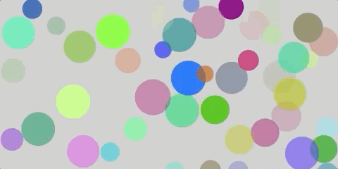
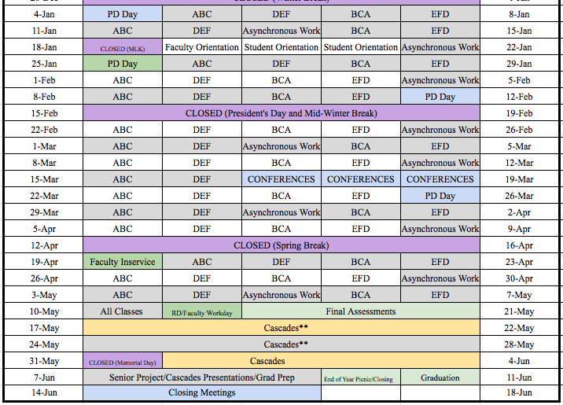
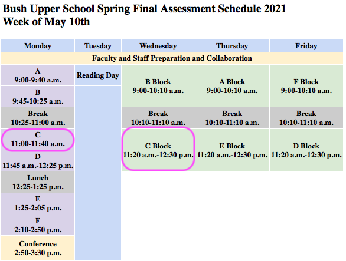

[_Bush School IDMD Spring Semester 2021_](https://chandrunarayan.github.io/idmd/)

# IDMD - Interactive Digital Media Design
Software influences all aspects of contemporary visual culture. This course is an introduction to computer programming within the context of the visual art. Students in this course will learn the fundamentals of computer programming -- conditional control structures, iteration, data structures, functions, classes, objects, and event-driven design. We will create projects based on student interest including, but not limited to games, machine-learning inspired art, simulations of physical, biological and social phenomena.

We will learn and create using the programming language Javascript and the library p5.js, a full featured library that allows one to create interactive digital art for the web. Below is an example of a game you could develop using P5JS and Javascript!

### Bouncing Bubbles Model Javascript Program

<a href="https://chandrunarayan.github.io/sketches/bubbles" target="blank">Click here for live code of bouncing bubbles and try clicking them inside resulting new tab or window. Like what you see? This course will be all about developing skills to simulate nature on your computer in a fun, engaging manner and learn Javascript on the side!</a>

## Remote/Hybrid Classroom Applications

In our IDMD classroom we are already using tools and techniques that are naturally adapted to a remote learning format. We will continue using our already established tools and techniques for learning IDMD.  We will add to that, a video conferencing solution  to complete our toolset needed for remote learning! All applications (except email) are to be run using your Chrome Browser on your laptop. 

1. [ZOOM for IDMD](https://zoom.us/j/5176316708) - video conferencing application - join here each day and time IDMD classes are held
2. [IDMD WEBSITE](https://chandrunarayan.github.io/idmd/) - lessons, exercises, projects, student-portfolios, references
3. [Google Classroom](https://classroom.google.com/u/0/c/MjQ5OTg2OTEwMDEz?cjc=gmy37a3) - code extracts, worksheet and document submissions, additional materials
4. [GITHUB repository](https://github.com/) - code submissions for exercises and projects, published student portfilios
5. [P5JS Web Editor](https://editor.p5js.org) - web code editor for p5js
6. [Student Portfolios](student-work.md) - Links to Student Porfolios
6. [IDMD Slack Messaging](https://app.slack.com/client/TTS9Y46VC/G01LL5FGCV7) - Links to IDMD Slack Messaging for Code Extracts etc.
7. [Online textbooks](https://drive.google.com/drive/folders/1_zq8eZnKCsoD5Y-22_pZfTbOgZg2dwmB?usp=sharing) - Getting Started with P5JS & Learn Javascript with P5JS
8. [Bush PORTAL](https://bush.myschoolapp.com/app/faculty#academicclass/110760511/0/bulletinboard) - links for all tools, official assignments, schedules, syllabus, grade rubric
9. Conference Appointments:
   * [Async Zoom Scheduler](https://calendly.com/chandru-narayan/anytime-wed-async) - Wed/Thu 9:00 AM to 5:30 PM
   * [Ad-Hoc 1-1 Conf Scheduler](https://calendly.com/chandru-narayan/anytime-wed-async) Weekdays: 3:00-8:00 PM
10. EMAIL - check your Bush email when all other forms of communication fails! 

## 2021 Weekly Schedule

* [Daily Health Screening before Campus Arrival](https://forms.office.com/Pages/ResponsePage.aspx?id=a1889x_4-0Ob0n7ko0Og-VAn6i3AlVpLnGArk2hPCDFUNVFFUVlMWEk0Sk9DMUpPVkg3WllRVVRYOC4u)
* [Faculty/Staff On Campus Form](https://docs.google.com/forms/d/e/1FAIpQLScPfJwgQTUNx-86SPGF2UpaxTvuKqYQfIfW2shM4pOOapucew/viewform)
* [Lunch Assignments & Remote Students Roster](https://docs.google.com/spreadsheets/d/1zUfECDQHdLX9Wg1Q_MNokOrYd7GXkEOLYGulvWUvKPQ/edit?ts=608080fc#gid=919051611)
* [Assigned Classroom Spaces for Hybrid Schooling](https://docs.google.com/spreadsheets/d/1ptL6A439QUUwwVE4XioRQpLjxhR3keJVzTiOWTpGizo/edit?usp=sharing_eip&ts=60819645)

### FINAL WEEK of the IDMD class & Semester! May 10th - May 14th

[Sharing Final Projects!](student-work.md)

#### Expectations for School Work
![alt text][schoolwork]

#### A Reminder
We are all going through some extraordinary times due to the coronavirus.  I would like to ask you to be safe and considerate of others. Let us take time to be vigilant about wearing masks, washing hands, not touching our face and avoiding being in large groups. Most of all, be calm about things beyond our control.

## Course Documents

* [Syllabus](syllabus.md)
* [Topic List](topic-list.md)
* [Student Portfolios](student-work.md)
* [Exercise/Project Requirements](final-project.md)

## Course Links

* Course Website: [IDMD 2021 Website](https://chandrunarayan.github.io/idmd/)
* Bush Portal: [IDMD Portal](https://bush.myschoolapp.com/app/faculty#academicclass/110760511/0/bulletinboard)
* Online textbook: [Getting Started with P5JS](https://drive.google.com/drive/folders/1_zq8eZnKCsoD5Y-22_pZfTbOgZg2dwmB)
* P5JS Basics: [Wiki Page for Help Examples and Reference](https://github.com/processing/p5.js/wiki/JavaScript-basics)
* Other Course materials: [Google Drive IDMD](https://drive.google.com/drive/folders/1y16Sl6du4C773Iy2czlFcVXpeBPmvFYN)
* Assignment Submissions via [Your Github Site](https://github.com/)

## Learning Modes and Typical Student Workflow
### Learning by Doing First - Student-Based Asynchronous Workflow
In this mode of learning we will simultaneously start a consolidatded student-paced session spanning multiple P5JS topics, supported by working on visual and creative projects within Paired Programming teams. Subsequently we will use the [online text books](https://drive.google.com/drive/folders/1_zq8eZnKCsoD5Y-22_pZfTbOgZg2dwmB?usp=sharing) for a more complete discussion of ideas and creative extensions. We will mostly be using this workflow model, switching to Synchronous in small bursts as directed by your teacher or as needed to support student needs.
### Doing by Learning First - Lecture-Based Synchronous Workflow
We will use this method of learning sparingly, reserved for difficult topics that might require a lecture-based instructional unit.  The lectures below are designed in that manner and always available as a reference while we live in the world of Asynchronous "Learning by Doing First" model above.

## Lessons

### Mini Lesson for newly admitted Upper School Students!
### [Click here to access mini lesson](lessons/minilesson)
### [Week of Jan 4](lessons/week1)

_Topics: Installfest, git, github, why p5.js, environment setup, using the reference, digital color, coordinate system_

* [Overview](lessons/week1)
* [Portfolio Setup](lessons/week1/portfolio.md)
* [Exercises](lessons/week1/#exercises)
* [Project: Robot](lessons/week1/exercises/robot.md)

### [Week of Jan 11 & 18](lessons/week2)

_Topics: Programming flow, animation loops, functions, parameters, variables, max, min, sound_

* [Overview](lessons/week2)
* [Lesson Plan](lessons/week2/plan.md)
* [Exercises](lessons/week2/#exercises)

### [Week of Jan 25 After Orientation](lessons/week3)

_Topics: Conditional statements, logical operators, events, mouseX, mouseY, mouesIsPressed, frameCount, random, dist, mousePressed, mouseReleased, max, min_

* [Overview](lessons/week3)
* [Exercises](lessons/week3/#exercises)
* [Project: Interactive Monster](lessons/week3/homework/interactive-monster.md)

### Week of Feb 1 - Review & Code Exercises

* [Textbook and Code Exercises](lessons/week3/plan)
* [Previous week Code Review](lessons/week3/#exercises)
* [Project: Interactive Monster](lessons/week3/homework/interactive-monster.md)

### [Week of Feb 8 & 15th](lessons/week4) 

_Topics: keyPressed events, while and for loops, using text and fonts, using images_

* [Overview](lessons/week4)
* [Exercises](lessons/week4/code)

### [Week of Feb 22 After Mid-Winter Break](lessons/week5)

_Topics: Review for loops, while loops, arrays, return statements, data vis_

* [Overview](lessons/week5)
* [Exercises](lessons/week5/code)
* [Project: Data Visualization](lessons/week5/homework/data-visualization.md) OR [Project: Creative Animation](lessons/week5/homework/creative-animation.md)

### [Week of Mar 1](lessons/week6)

_Topics: Continue for loops, while loops, arrays, return statements, data vis_

* [Overview](lessons/week6)
* [Exercises](lessons/week5/code)
* [Project: Data Visualization](lessons/week5/homework/data-visualization.md) OR [Project: Creative Animation](lessons/week5/homework/creative-animation.md)

### [Week of Mar 8](lessons/week7)

_Topics: Tweening Shaking Timer_

* [Overview](lessons/week7)
* Exercises and Project submissions ahead of comments
* Tweening, Random, Shaking
* Timer based trigger exercise 

### [Week of Mar 15 - Short comments week](lessons/week7)

_Topics: Review_Catchup_
* [Online Book References](https://drive.google.com/file/d/18kfdShfj79ISxFTn-iw1ahFTtuFY-KF9/view?usp=sharing)
* Open your local copy you have previously downloaded to yout laptop. If not download above and open locally.
    *  Chapetr 9:  Functions
    *  Chapter 11.1 to 11.8: Arrays

### [Week of Mar 22](lessons/week8)

_Topics: Repl editor, Debugging, Perlin Noise_

* [Overview](lessons/week8)

### [Week of Mar 29](lessons/week9)

_Topics: 2D & Dynamic Perlin Noise, Sliders, html text, Particles_

* [Overview](lessons/week9)

### [Week of Apr 5](lessons/week9)

_Topics: Catch-up with Pending assignments & projects_

* [Overview](lessons/week10)

### [Weeks of Apr 19 and Apr 26th After Spring Break](lessons/week11)

_Topics: Classes, Objects, Interactions, Animations_
* [Overview](lessons/week11)

### [Week of May 3 - Final Project Week!](lessons/week11)

_Topics: Final Project Assignments_
* [Overview](lessons/week11)

### [Week of May 10 - All assignments & Projects due!]()

_Topics: Submit Final Project_
*  [Overview]()

## Course Credit

This course draws from the materials used in the UW Human Center for Design Engineering Master of Science curriculum. Significant credit is also due to the many member founders of the Processing Foundation whose tireless efforts have advanced the cause for open, accessible, and free CS education across the world.

[washhands]: https://www.cdc.gov/handwashing/images/GettyImages-514363103-medium.jpg "Wash Hands"

[congrats]: congrats.png "Congrats"

[schoolwork]: schoolwork.png
